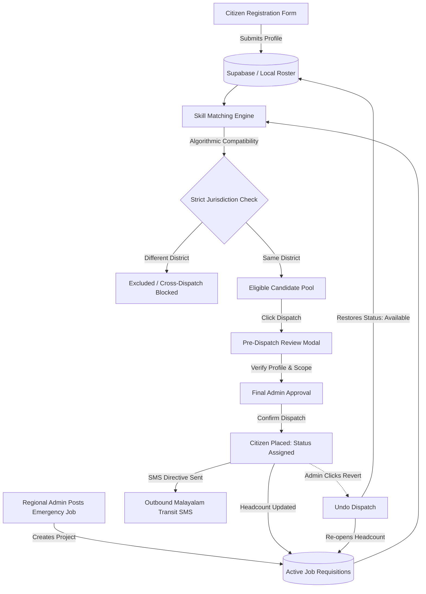

# SahayaSetu: Complete Project Structure & Components Guide

This document provides a simple, clear, and comprehensive explanation of **every folder, file, view, component, service, and utility** in the SahayaSetu Disaster Rehabilitation & Vocational Matching Platform.

---

## 1. What is SahayaSetu?

**SahayaSetu** (സഹായസേതു) is an emergency humanitarian civil reconstruction and disaster rehabilitation platform built for the **Kerala State Disaster Management Authority (KSDMA)**.

The platform coordinates relief between three main user roles:
1. **Citizen / Displaced Artisan**: Registers vocational skills (masonry, carpentry, electrical, etc.), tracks daily wage records, accesses relief passes, and views job assignments.
2. **Regional Disaster Administrator**: Operates at the district level (e.g. Wayanad, Kozhikode, Idukki). Manages local relief camp rosters, posts urgent reconstruction requisitions, matches local artisans, and dispatches workers with automated SMS transit passes.
3. **Statewide Super Administrator**: Oversees all 14 Kerala districts, manages regional admin accounts and district disasters, views region-wise analytics, and monitors statewide reconstruction telemetry.

---

## 2. Directory Tree Overview

```
sahayasetu/
├── docs/                                  # In-depth architectural & technical documentation
│   └── TECHNICAL_DESIGN_DOCUMENT.md
├── public/                                # Static web assets & icons
├── src/                                   # Application source code
│   ├── components/                        # Reusable UI widgets, modals, drawers & banners
│   ├── context/                           # React Context providers (Auth, Language)
│   ├── lib/                               # Third-party client setups (Supabase)
│   ├── services/                          # API, database sync, and storage services
│   ├── styles/                            # CSS design system, design tokens & themes
│   ├── types/                             # TypeScript data models and interfaces
│   ├── utils/                             # Helper functions & jurisdiction rules
│   ├── views/                             # Full-screen module views and workstations
│   ├── App.tsx                            # Root application shell and central state manager
│   ├── main.tsx                           # Application entry point mounting React to DOM
│   └── vite-env.d.ts                      # TypeScript definitions for Vite environment
├── supabase/                              # Database schema, PostGIS tables & SQL functions
│   └── schema.sql
├── .env                                   # Environment configuration (Supabase keys)
├── index.html                             # Single Page Application HTML shell
├── package.json                           # Dependencies & project execution scripts
├── tsconfig.json                          # TypeScript compiler settings
└── vite.config.ts                         # Vite development server and bundling config
```

---

## 3. Root Files Explained

| File | Purpose |
| :--- | :--- |
| **`index.html`** | The main HTML entry point. Loads Google Fonts (Inter, Material Symbols) and mounts the React root `div`. |
| **`package.json`** | Defines project metadata, npm scripts (`dev`, `build`, `preview`), and dependencies (`react`, `@supabase/supabase-js`, `jspdf`, `vite`). |
| **`vite.config.ts`** | Vite bundler configuration. Configures React Fast Refresh, dev server ports, and build output directories. |
| **`tsconfig.json`** | TypeScript compiler configuration ensuring strict type-safety, JSX transforms, and modern ES module resolution. |
| **`.env`** | Contains active runtime environment secrets: `VITE_SUPABASE_URL` and `VITE_SUPABASE_ANON_KEY`. |
| **`.env.example`** | Safe template showing placeholder keys for new team members configuring their local setup. |
| **`render.yaml`** | Deployment configuration blueprint for cloud hosting on Render. |

---

## 4. `src/views/` (Module Workstations)

These files represent the main screens and functional portals of the application:

### 1. `SuperAdminCommandView.tsx`
* **Role**: Statewide Super Administrator.
* **Function**: Comprehensive mission command center.
* **Features**:
  - **Statewide Disaster Telemetry**: Live KPI cards showing registered displaced persons, emergency projects, active workforces, and relief payments.
  - **Disaster Management Section**: Add, update, and manage active disaster declarations per district (e.g. landslides, flash floods, dam overflows).
  - **Regional Admin Management**: Create district administrators with credentials, update permissions, suspend admins (instantly logs them out), or delete records entirely.
  - **Region-Wise Data Analysis**: Deep-dive analytics comparing district rosters, trade demographics, and shelter populations across Kerala.
  - **Statewide Dispatch Roster**: Global view of all requisitions and assigned workers across all 14 districts.

### 2. `SuperAdminLoginView.tsx`
* **Role**: Super Admin security gateway.
* **Function**: Master authentication screen with high-security PIN and passphrase credentials protecting the Statewide Command Center.

### 3. `RegionalAdminLoginView.tsx`
* **Role**: Regional Relief Coordinator security gateway.
* **Function**: District-scoped portal login screen where regional officers enter their SDMA Officer ID and password to access their district's relief operations.

### 4. `SkillMatchingView.tsx`
* **Role**: Regional Admin & Super Admin (View-only for Super Admin).
* **Function**: Two-column emergency vocational matching engine:
  - **Left Column**: Active civil reconstruction projects (e.g. riverbank retaining walls, culvert shoring, road clearing) with quota progress meters.
  - **Right Column**: Algorithmic candidate matching. Evaluates Trade Overlap (50%), Proximity (25%), and Physical Fitness (25%) to calculate a compatibility score (e.g. 96%).
  - **Currently Assigned Workers**: Displays deployed workers for the selected project with a 1-click **"Revert Dispatch"** button.
  - **Strict Jurisdiction Enforced**: Only displays candidates residing within the project's home district.

### 5. `BeneficiaryIntakeView.tsx`
* **Role**: Regional Admin & Super Admin.
* **Function**: High-density situational roster of all registered displaced citizens in the district:
  - Search, filter by trade/skill, living status (Relief Camp vs. Makeshift Shelter), and placement status.
  - **Action Buttons**: View full candidate profile dossier, delete record, or 1-click **"Revert"** job assignment.
  - **Export**: Generates and downloads real CSV reports for district relief meetings.

### 6. `UserRegistrationView.tsx`
* **Role**: Public Citizen / Relief Camp Field Volunteer.
* **Function**: Multi-step, bilingual citizen registration form:
  - Captures legal name, phone, Aadhaar verification, district, relief camp name, calamity impact, and living condition.
  - **Vocational Skills Selection**: Multi-select trade chips (Masonry, Carpentry, Electrical, Plumbing, etc.) plus a custom input field for unlisted trades.
  - **Financial Inclusion**: Bank account number, IFSC code, and DBT (Direct Benefit Transfer) status.

### 7. `BeneficiarySelfPortalView.tsx`
* **Role**: Logged-in Citizen User.
* **Function**: Citizen's personal assistance hub:
  - Displays application status, verification badge, and relief camp details.
  - **Active Job Assignment**: Shows current assigned project, agency, worksite, and guaranteed daily wage.
  - **Wage Ledger**: Historical tracking of civil reconstruction workdays and bank transfers.
  - **Direct Regional Helpline**: Displays contact details for their assigned district regional relief officer.

### 8. `GoogleSignInView.tsx`
* **Role**: Public Citizen Authentication.
* **Function**: Google OAuth sign-in gateway allowing displaced citizens to log into their applications securely using Google credentials.

---

## 5. `src/components/` (UI Components & Modals)

Reusable interface elements, popups, and navigational headers:

| Component | Description |
| :--- | :--- |
| **`Header.tsx`** | Top navigational bar. Displays current disaster advisory alerts, role switcher (Regional Admin, Super Admin, Citizen User), language switcher (English / Malayalam), simulated offline VSAT toggle, and notification bell. |
| **`Sidebar.tsx`** | Left navigation menu. Adapts dynamically to the active user role, offering quick links to Roster, Skill Matching, Command Center, Region Analysis, Application Form, and Profile. |
| **`DispatchApprovalModal.tsx`** | **Pre-Dispatch Review Modal**. Appears before a Regional Admin issues a relief pass. Displays full candidate profile, project scope, algorithmic match breakdown, strict jurisdiction check, and outbound Malayalam SMS preview before final confirmation. |
| **`PostNeedModal.tsx`** | Modal drawer enabling regional admins to publish new emergency civil rebuilding job vacancies with wage rates, required trade, duration, and quota. |
| **`EditJobModal.tsx`** | Modal enabling regional admins to modify already-posted emergency jobs (update required trades, wage, duration, priority, or headcount). |
| **`UserDetailsModal.tsx`** | Comprehensive dossier modal showing all details of a registered citizen (biometrics, bank details, emergency contacts, vocational experience). |
| **`IntakeDrawer.tsx`** | Rapid field registration slide-over drawer for volunteers registering people at camp desks without leaving the live roster. |
| **`OfflinePassModal.tsx`** | Generates digital and printable cryptographic relief transit passes with QR codes for military/police checkpoints. |
| **`LanguageSelectionModal.tsx`** | Language selection popup supporting Malayalam and English. |
| **`RegionalAdminLoginModal.tsx`** | Quick modal popup for Regional Admin authentication. |
| **`EditRegionalAdminCredentialsModal.tsx`** | Modal allowing active Regional Admins to update their password and contact details. |
| **`Toast.tsx`** | Floating notification banner displaying success, warning, or informational alerts with SMS audit references. |

---

## 6. `src/services/` (Backend & Data Layer)

Services handling data persistence, remote database synchronization, and local caching:

### 1. `supabaseService.ts`
* Primary bridge to the Supabase PostgreSQL database.
* Provides functions to:
  - Fetch and persist beneficiaries (`fetchAllBeneficiaries`, `persistBeneficiary`).
  - Fetch and persist job requisitions (`fetchJobPostsFromDb`, `persistJobPost`).
  - Fetch and persist regional admins (`fetchRegionalAdminsFromDb`, `persistRegionalAdminToDb`).
  - Fetch and update disaster listings (`fetchDisasterDetailsFromDb`, `persistDisasterToDb`).
  - Real-time subscriptions via PostgreSQL WebSockets (`subscribeToAllEntitiesRealtime`).

### 2. `regionalAdminService.ts`
* Manages default regional administrator accounts across all 14 Kerala districts.
* Handles regional session storage, credentials validation, password resets, suspension checks, and user purging.

### 3. `notificationService.ts`
* Powers the citizen alert system.
* Sends job assignment notifications with bilingual messages (Malayalam & English).
* Implements `revertCitizenJobAssignment(beneficiaryId)` to clean up notifications when a job dispatch is undone.

### 4. `disasterService.ts`
* Manages the official registry of district-specific disasters (e.g. Wayanad Chooralmala Landslides, Idukki Flash Floods).
* Supports adding, updating, and syncing disaster alerts to Supabase.

---

## 7. `src/utils/` (Helper Utilities)

### `jurisdictionUtils.ts`
* **Purpose**: Enforces strict regional jurisdiction across the platform.
* **Functions**:
  - `KERALA_DISTRICT_MAP`: Canonical dictionary of all 14 Kerala districts and common aliases.
  - `normalizeDistrictCode(raw)`: Standardizes any text into a valid district code (e.g. "Wayanad" -> `KL-WYD-2024`).
  - `isSameJurisdiction(beneficiary, requisition)`: Compares citizen and project districts. Returns `true` only if they belong to the exact same district.
  - `getDistrictDisplayName(codeOrName)`: Returns a clean human-readable name (e.g. "Wayanad").

---

## 8. `src/context/` (Global State)

| Context | Purpose |
| :--- | :--- |
| **`AuthContext.tsx`** | Provides user authentication state, handles Google Sign-In, Supabase Auth user sessions, and role persistence. |
| **`LanguageContext.tsx`** | Provides global language toggling between English (`EN`) and Malayalam (`ML`), translating interface text throughout the app. |

---

## 9. `src/types/` (Data Models)

### `index.ts`
Defines all TypeScript interfaces used throughout the platform:
- `Beneficiary`: Displaced person record (skills, Aadhaar, camp, medical fitness, placement status, district).
- `JobRequisition`: Emergency civil project posting (trades required, headcount, daily wage, duration, district).
- `CandidateMatch`: Output of the skill matching engine (overlap score %, distance in km, score breakdown).
- `RegionalAdminAccount`: District administrator account (officer ID, assigned district, status, permissions).
- `DistrictTenant`: District governance and disaster readiness metrics.
- `DisasterDetail`: District disaster registry entry.

---

## 10. `src/styles/` (Design System)

SahayaSetu uses a custom Vanilla CSS design system built on CSS variables:

| Style File | Purpose |
| :--- | :--- |
| **`tokens.css`** | Design tokens defining color palettes (Forest Green primary, Terracotta secondary, Warning Amber), spacing scales, border radii, and elevation shadows. |
| **`global.css`** | Base CSS resetting margins, typography rules (Inter, Outfit), responsive layout containers, and CSS grid definitions. |
| **`components.css`** | Styling rules for badges, buttons, cards, modals, form inputs, status chips, and tables. |

---

## 11. `supabase/` (Database & Schema)

| File | Purpose |
| :--- | :--- |
| **`supabase/schema.sql`** | Complete PostgreSQL database schema with tables for `users`, `job_posts`, `regional_admins`, and `disaster_details`, complete with Row Level Security (RLS) policies and complete seed datasets for all 14 Kerala districts. |

---

## 12. Complete Workflow at a Glance



---

*Document compiled for SahayaSetu. Last updated: September 2026.*
