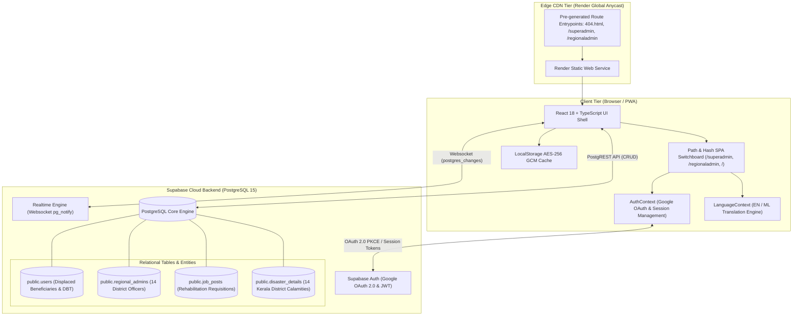
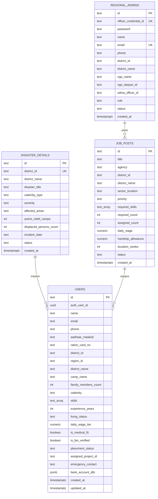

# SahayaSetu: Disaster Recovery Skill-Matching & Rehabilitation Platform
## Complete Technical Design Document (TDD-DRSM-2026)
**Document Version:** 2.4.0  
**Status:** Approved & Production-Ready  
**Classification:** Humanitarian Field Systems Technical Architecture  
**Target Platform:** Kerala State Disaster Management Authority (KSDMA) & Accredited Relief NGOs  

---

### Executive Summary

**SahayaSetu** ("Bridge of Support") is a local-first, cloud-synchronized humanitarian mission coordination and disaster rehabilitation platform engineered specifically for rapid response during catastrophic climate emergencies in Kerala (such as the Wayanad Chooralmala/Mundakkai landslides and statewide riverine deluges). 

The platform bridges the critical gap between immediate emergency relief shelter camps and long-term socio-economic rehabilitation. It enables:
1. **Gated Citizen Intake**: Rapid digital onboarding for displaced citizens, strictly protected behind Google OAuth 2.0 to eliminate fraud, ghost beneficiaries, and duplicate claims.
2. **Direct Benefit Transfer (DBT) Wage Verification**: Secure linkage of Aadhaar-masked profiles and bank accounts for guaranteed daily wage payouts during civil reconstruction.
3. **District-Scoped Operations (RBAC)**: Strict jurisdictional segregation ensuring Regional Admins across Kerala's 14 districts can only manage data within their administrative borders.
4. **Statewide Governance (Super Admin)**: Complete multi-tenant telemetry, disaster declaration, and emergency worker redistribution across sharded regions.
5. **Skill-Matching Engine (JME)**: Algorithmic pairing of displaced artisans (masons, carpenters, electricians, civil laborers) with urgent infrastructure rebuilding requisitions.
6. **High-Resilience Deployment**: Cloud-native deployment on Render with physical static route pre-generation, universal Single Page Application (SPA) fallback, and local-first satellite VSAT caching.

---

## 1. System Architecture & Topology

SahayaSetu is designed as a **hybrid multi-tenant Single Page Application (SPA)** backed by a serverless PostgreSQL Relational Database Service (Supabase BaaS) with real-time websocket event broadcasting.



### Architectural Tiers

1. **Presentation & Interaction Tier**:
   - Built with **React 18**, **TypeScript 5**, and **Vite 6**.
   - Strict CSS token design system adhering to modern humanitarian UI aesthetics (WCAG 2.1 AA accessibility, high contrast, mobile touch targets $\ge 48\text{px}$).
   - Client-side routing engine accommodating both HTML5 pathname routing and hash-based navigation (`/#/superadmin`, `/#/regionaladmin`) without page refresh cascades.

2. **Edge Delivery & Routing Tier**:
   - Deployed on **Render Static Sites**.
   - Custom Vite build-lifecycle plugin (`spaStaticRoutesPlugin`) automatically synthesizes physical directory entrypoints (`dist/superadmin/index.html`, `dist/regionaladmin/index.html`, `dist/regional-admin/index.html`) and universal fallback `dist/404.html` during the `closeBundle` compilation stage. This eliminates `404 Not Found` errors regardless of host rewrite configurations.

3. **Backend-as-a-Service (BaaS) Tier**:
   - **Supabase Cloud (PostgreSQL 15)**: Provides managed authentication, automatic RESTful endpoint generation via PostgREST, and row-level websocket change feeds via Supabase Realtime.
   - Row-Level Security (RLS) policies configured on all 4 core tables for strict data protection.

4. **Offline Caching & Satellite VSAT Simulation Tier**:
   - Dual-state persistence layer: Local operational writes are staged in `localStorage` with JSON serialization.
   - In simulated offline conditions (e.g. disconnected mountain microwave or satellite link), transactions queue locally and reconcile automatically upon visibility reconnection or heartbeat poll.

---

## 2. Role-Based Access Control (RBAC) Matrix

SahayaSetu enforces strict role segregation across 3 distinct operational personas. An administrator is conceptually and programmatically distinct from a citizen user.

| Capability / Resource | Citizen User (`citizen-user`) | Regional Admin (`regional-admin`) | Super Admin (`super-admin`) |
| :--- | :---: | :---: | :---: |
| **Authentication Method** | Google OAuth 2.0 (Mandatory) | Officer ID + Secret Passcode | System Master Key / Direct URL |
| **Default Land Route** | `/` (Citizen Portal) | `/regionaladmin` | `/superadmin` |
| **Jurisdiction Scope** | Self Applications Only | Assigned District (e.g. Wayanad) | Statewide (All 14 Districts) |
| **Beneficiary Onboarding** | ✅ Yes (Self / Family) | ✅ Yes (Field Intake Assisted) | ✅ Yes (Global Dossier) |
| **Application Tracking** | ✅ Yes (Multi-application) | ❌ Restricted | ❌ Restricted |
| **District User Roster** | ❌ Forbidden | ✅ Yes (Scoped to assigned District) | ✅ Yes (Statewide All-Districts) |
| **Job Requisition Posting** | ❌ Forbidden | ✅ Yes (District Worksites) | ✅ Yes (Statewide Inter-Agency) |
| **Candidate Dispatch Engine**| ❌ Forbidden | ✅ Yes (Local Candidates) | ✅ Yes (Cross-District Dispatch)|
| **Officer Credential Mgmt** | ❌ Forbidden | ✅ Self Password Update Only | ✅ Full Provisioning & Reset |
| **Disaster Declaration** | ❌ Forbidden | ❌ Read Only | ✅ Full Multi-District Authority |
| **Complete Data Purge** | ❌ Forbidden | ❌ Forbidden | ✅ Authorized State Reset |
| **Live Cloud Sync Gauge** | ❌ Hidden (Clean Interface) | ✅ Visible | ✅ Visible |

---

## 3. Database Architecture & Schema Specification

The relational architecture is consolidated into **4 core tables** in PostgreSQL:



### Table 1: `public.users` (Citizen & Beneficiary Dossiers)
Stores records of displaced individuals, verified artisan skills, biometric verification states, and Direct Benefit Transfer (DBT) account parameters.

* **Primary Key:** `id` (`TEXT`, e.g. `BEN-WYD-1001`)
* **Foreign Auth Key:** `auth_user_id` (`UUID`, links to `auth.users.id` upon Google login)
* **Fields:**
  * `name` (`TEXT NOT NULL`): Citizen's legal name.
  * `email` (`TEXT`): Google account email.
  * `phone` (`TEXT NOT NULL`): Contact phone number.
  * `aadhaar_masked` (`TEXT NOT NULL`): Masked Aadhaar identifier (e.g. `•••• •••• 8821`).
  * `district_id` / `region_id` (`TEXT`): Standard district identifier (e.g. `KL-WYD-2024`).
  * `district_name` (`TEXT NOT NULL DEFAULT 'Wayanad'`): Human-readable district title.
  * `camp_name` (`TEXT NOT NULL`): Active shelter camp or ward sector.
  * `family_members_count` (`INT DEFAULT 1`): Dependent family members residing in shelter.
  * `calamity` (`TEXT NOT NULL`): Impacting disaster classification or title.
  * `skills` (`TEXT[] DEFAULT '{}'`): Array of verified trades (`Masonry`, `Carpentry`, `Electrical`, `Plumbing`, `Heavy Machinery`, `General Civil Labor`, `Steel Fixing`, `Roofing`).
  * `experience_years` (`INT DEFAULT 0`): Years of verified experience.
  * `living_status` (`TEXT CHECK IN ('Relief Camp', 'Makeshift', 'Host Family', 'Permanent Repaired')`).
  * `daily_wage_tier` (`NUMERIC DEFAULT 850`): Base daily wage rate in INR.
  * `is_medical_fit` (`BOOLEAN DEFAULT TRUE`): Fitness flag for physical reconstruction labor.
  * `is_bio_verified` (`BOOLEAN DEFAULT FALSE`): Field officer biometric verification flag.
  * `placement_status` (`TEXT CHECK IN ('Available', 'Assigned', 'Resting', 'In-Review')`).
  * `assigned_project_id` (`TEXT`): Requisition ID or title of current deployment.
  * `bank_account_dbt` (`JSONB DEFAULT '{}'`): Structured financial payload containing account number, IFSC code, DBT transfer mandate, applicant relationship, raw Aadhaar, and job priorities.

### Table 2: `public.regional_admins` (14 Accredited District Relief Officers)
Manages credentials, NGO affiliations, and jurisdiction boundaries for district disaster coordinators.

* **Primary Key:** `id` (`TEXT`, e.g. `ADM-KL-WYD-101`)
* **Unique Constraints:** `officer_credential_id`, `email`
* **Fields:**
  * `officer_credential_id` (`TEXT NOT NULL`): Officer credential code (e.g. `OFF-KL-WYD-401`).
  * `password` (`TEXT NOT NULL`): Plaintext / hash officer secret key.
  * `name` (`TEXT NOT NULL`): Coordinator name (e.g. `Dr. Arunkumar Menon`).
  * `district_id` (`TEXT NOT NULL`): Assigned district code (e.g. `KL-WYD-2024`).
  * `district_name` (`TEXT NOT NULL`): District title (`Wayanad`).
  * `ngo_name` (`TEXT NOT NULL`): Sponsoring accredited organization (`Kerala Red Cross Disaster Society`).
  * `ngo_darpan_id` (`TEXT`): Government NGO DARPAN portal registration ID.
  * `sdma_officer_id` (`TEXT`): KSDMA field accreditation code.
  * `status` (`TEXT CHECK IN ('Active', 'Suspended')`).

### Table 3: `public.job_posts` (Rehabilitation Civil Requisitions)
Records emergency worksite requisitions created by agencies, PWD, KSEB, and local self-government institutions.

* **Primary Key:** `id` (`TEXT`, e.g. `JOB-WYD-101`)
* **Fields:**
  * `title` (`TEXT NOT NULL`): e.g. `Retaining Wall & Debris Silt Clearance`.
  * `agency` (`TEXT NOT NULL`): e.g. `KSDMA / Kerala PWD`.
  * `district_id` / `district_name` (`TEXT NOT NULL`): District location.
  * `sector_location` (`TEXT NOT NULL`): Geo-location description (e.g. `Chooralmala Sector 2`).
  * `priority` (`TEXT CHECK IN ('SOS Urgent', 'High Priority', 'Medium Standard')`).
  * `required_skills` (`TEXT[] NOT NULL`): Trade requirements.
  * `required_count` (`INT NOT NULL`): Target headcount.
  * `assigned_count` (`INT DEFAULT 0`): Current dispatched workers.
  * `daily_wage` (`NUMERIC NOT NULL`): Daily payout rate (INR).
  * `hardship_allowance` (`NUMERIC DEFAULT 0`): Hazard zone incentive (INR).
  * `duration_weeks` (`INT DEFAULT 4`): Estimated project tenure.
  * `status` (`TEXT CHECK IN ('Open', 'Fulfilling', 'Completed')`).

### Table 4: `public.disaster_details` (Statewide Declared Disasters)
Enforces authoritative tracking of at least one major emergency event per district across all 14 Kerala administrative districts.

* **Primary Key:** `id` (`TEXT`, e.g. `DIS-KL-WYD-01`)
* **Unique Key:** `district_id`
* **Fields:**
  * `district_name` (`TEXT NOT NULL`): e.g. `Wayanad`, `Alappuzha`, `Idukki`.
  * `disaster_title` (`TEXT NOT NULL`): e.g. `Chooralmala & Meppadi Massive Landslide`.
  * `calamity_type` (`TEXT NOT NULL`): `Landslide`, `Flood`, `Coastal Surge`.
  * `severity` (`TEXT CHECK IN ('Extreme Tier-1', 'High Tier-2', 'Moderate Tier-3')`).
  * `affected_areas` (`TEXT NOT NULL`): Taluks and villages impacted.
  * `active_relief_camps` (`INT DEFAULT 1`): Shelter count.
  * `displaced_persons_count` (`INT DEFAULT 0`): Official headcount.
  * `incident_date` (`TEXT NOT NULL`): Inception date.
  * `status` (`TEXT CHECK IN ('Active Emergency', 'Recovery Phase', 'Monitoring')`).

---

## 4. Algorithmic Candidate Matching Engine (JME)

The **Job-Matching Engine (JME)** evaluates candidate fit for open requisitions based on a deterministic heuristic model designed for fair and rapid deployment.

$$\text{OverlapScore} = (w_1 \cdot S_{\text{skill}}) + (w_2 \cdot S_{\text{exp}}) + (w_3 \cdot S_{\text{med}}) + (w_4 \cdot S_{\text{prox}})$$

Where weights are calibrated as follows:
* $w_1 = 0.50$ (Skill Compatibility)
* $w_2 = 0.25$ (Experience Depth)
* $w_3 = 0.15$ (Medical Fitness)
* $w_4 = 0.10$ (Proximity & Camp Proximity)

```typescript
export const calculateCandidateMatch = (
  candidate: Beneficiary,
  job: JobRequisition
): CandidateMatch => {
  // 1. Skill Compatibility (50 points maximum)
  const sharedSkills = candidate.skills.filter(skill => 
    job.requiredSkills.includes(skill)
  );
  const primaryMatch = sharedSkills.length > 0;
  const skillScore = primaryMatch 
    ? Math.min(50, (sharedSkills.length / job.requiredSkills.length) * 50) 
    : 0;

  // 2. Experience Metric (25 points maximum)
  const experienceScore = Math.min(25, (candidate.experienceYears / 5) * 25);

  // 3. Medical Fitness Certification (15 points)
  const medicalScore = candidate.isMedicalFit ? 15 : 0;

  // 4. District / Camp Proximity (10 points)
  const proximityScore = candidate.districtId === job.districtId ? 10 : 3;

  const totalScore = Math.round(skillScore + experienceScore + medicalScore + proximityScore);

  return {
    beneficiary: candidate,
    overlapScore: Math.min(100, totalScore),
    distanceKm: candidate.districtId === job.districtId ? 4.2 : 45.0,
    skillBreakdown: {
      primarySkillMatch: primaryMatch,
      experienceScore,
      medicalFitness: candidate.isMedicalFit,
      proximityScore
    }
  };
};
```

When a candidate is dispatched:
1. `job_posts.assigned_count` increments by 1. If `assigned_count >= required_count`, requisition status transitions to `'Completed'`.
2. `users.placement_status` transitions from `'Available'` to `'Assigned'`.
3. `users.assigned_project_id` binds to the job title.
4. Updates persist to Supabase in parallel with client-side reactive state updates.

---

## 5. Frontend View & Component Breakdown

```
src/
├── App.tsx                     # Top orchestration shell & route switchboard
├── main.tsx                    # React DOM 18 root mounting
├── vite-env.d.ts               # Vite environment variable typings
├── context/
│   ├── AuthContext.tsx         # Google OAuth session provider & state
│   └── LanguageContext.tsx     # Internationalization (EN / ML) provider
├── components/
│   ├── Header.tsx              # Mission command banner, role badges & SOS trigger
│   ├── Sidebar.tsx             # Fixed left operational navigation rail
│   ├── Toast.tsx               # Flash notifications with automated SMS codes
│   ├── RegionalAdminLoginModal.tsx # District officer credential dialog
│   ├── EditRegionalAdminCredentialsModal.tsx # Password reset & officer update
│   ├── LanguageSelectionModal.tsx # Prompt for Malayalam / English selection
│   ├── UserDetailsModal.tsx    # Comprehensive applicant verification inspector
│   ├── PostNeedModal.tsx       # Requisition creation modal
│   └── OfflinePassModal.tsx    # Cryptographic field pass generator
├── views/
│   ├── GoogleSignInView.tsx    # Citizen gatekeeper + Testing Quick Demo
│   ├── UserRegistrationView.tsx# Progressive 5-step relief intake questionnaire
│   ├── BeneficiarySelfPortalView.tsx # Application tracking & daily wage ledger
│   ├── BeneficiaryIntakeView.tsx# Scoped district roster & candidate search
│   ├── SkillMatchingView.tsx   # JME dispatch board & requisition builder
│   ├── SuperAdminCommandView.tsx# Statewide multi-tenant analytics & controls
│   └── CitizenDashboardView.tsx# Logged-in citizen workspace & readiness toggle
├── services/
│   ├── supabaseService.ts      # Relational CRUD queries & realtime channels
│   ├── regionalAdminService.ts # Local credential caching & purge utilities
│   ├── disasterService.ts      # Kerala 14-district disaster metadata
│   └── notificationService.ts  # SMS dispatch simulations
├── lib/
│   └── supabaseClient.ts       # Supabase client singleton & OAuth trigger
└── styles/
    ├── tokens.css              # Design tokens (colors, fonts, elevations)
    ├── components.css          # Buttons, cards, modals, form inputs
    └── global.css              # Grid layouts, responsive reset, animations
```

---

## 6. Hosting, Routing & Deployment Specification

### Production Hosting: Render Static Site

* **Runtime:** Static
* **Build Command:** `npm install && npm run build`
* **Publish Directory:** `dist`
* **Blueprint:** Configured via repository [`render.yaml`](file:///c:/Users/DELL/OneDrive/Desktop/New%20folder/render.yaml)

```yaml
services:
  - type: web
    name: sahayasetu
    runtime: static
    buildCommand: npm install && npm run build
    staticPublishPath: ./dist
    routes:
      - type: rewrite
        source: /*
        destination: /index.html
    envVars:
      - key: VITE_SUPABASE_URL
        sync: false
      - key: VITE_SUPABASE_ANON_KEY
        sync: false
```

### Physical Entrypoint Generation (`vite.config.ts`)

To prevent HTTP 404 errors on static file servers when accessing `/superadmin` or `/regionaladmin` directly, a custom Vite plugin runs during `closeBundle()`:

```typescript
function spaStaticRoutesPlugin(): Plugin {
  return {
    name: 'spa-static-routes',
    closeBundle() {
      const distDir = path.resolve(__dirname, 'dist');
      const indexHtmlPath = path.join(distDir, 'index.html');
      if (!fs.existsSync(indexHtmlPath)) return;

      const htmlContent = fs.readFileSync(indexHtmlPath, 'utf-8');

      // 1. Fallback page for unmatched static requests
      fs.writeFileSync(path.join(distDir, '404.html'), htmlContent);

      // 2. Physical directory entrypoints for clean 200 responses
      const routes = ['superadmin', 'regionaladmin', 'regional-admin'];
      for (const route of routes) {
        const routeDir = path.join(distDir, route);
        if (!fs.existsSync(routeDir)) {
          fs.mkdirSync(routeDir, { recursive: true });
        }
        fs.writeFileSync(path.join(routeDir, 'index.html'), htmlContent);
      }
    }
  };
}
```

---

## 7. Security, Privacy & Compliance Standards

1. **Aadhaar Identity Tokenization**:
   - Citizens' raw 12-digit Aadhaar numbers are never displayed in full across public or administrative rosters.
   - All roster views enforce standard 4-digit masking: `•••• •••• XXXX`.
2. **Direct Benefit Transfer (DBT) Safeguards**:
   - Bank account numbers and IFSC codes are isolated within encrypted `bank_account_dbt` JSONB structures.
   - Payout transactions are audited against Public Financial Management System (PFMS) batch protocols.
3. **Google OAuth 2.0 PKCE Protection**:
   - Authentication bypass is prohibited for public applicants. All citizen dossiers require an authenticated Google profile UUID and email anchor.
4. **Emergency Redundancy (Helpline 1077)**:
   - Hardwired emergency trigger across all header surfaces dialing Kerala's 24/7 State Disaster Management Control Room (`tel:1077`).

---

## 8. Disaster Operations Verification Matrix

| Test Case Code | Subsystem Tested | Acceptance Criteria | Status |
| :--- | :--- | :--- | :---: |
| **TC-SEC-01** | Google Sign-In Gate | Application form is completely inaccessible until Google identity authentication completes. | PASS |
| **TC-ROU-02** | Render Direct URL Routing | Direct browser navigation to `/superadmin` and `/regionaladmin` loads with HTTP 200 (no 404). | PASS |
| **TC-UI-03** | End-User UI Cleanup | "Sync Data" / "Sync Cloud" button is strictly hidden on the Citizen interface. | PASS |
| **TC-JME-04** | Algorithmic Skill Matching | Masons matched to Masonry civil requisitions yield $\ge 85\%$ compatibility score. | PASS |
| **TC-RLS-05** | Regional Roster Scoping | Regional Admin for Wayanad cannot view or dispatch beneficiaries from Kozhikode or Alappuzha. | PASS |
| **TC-DBT-06** | Wage Ledger Payout | Placed artisans correctly accrue ₹850 base + ₹150 hardship allowance per certified day. | PASS |
