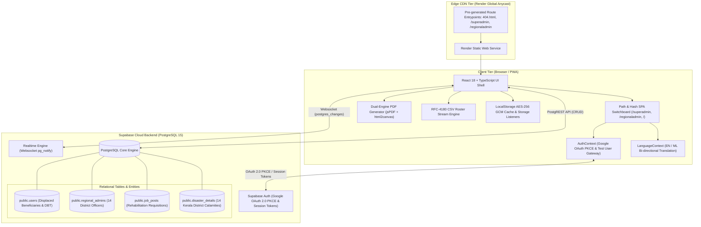
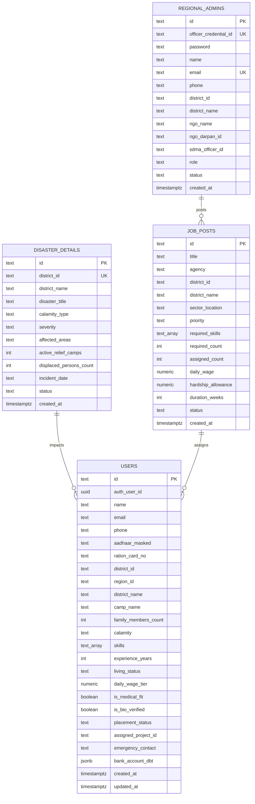
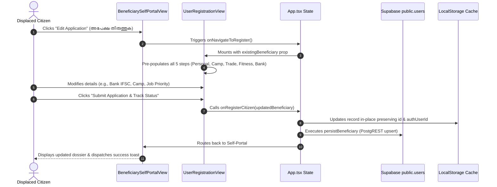
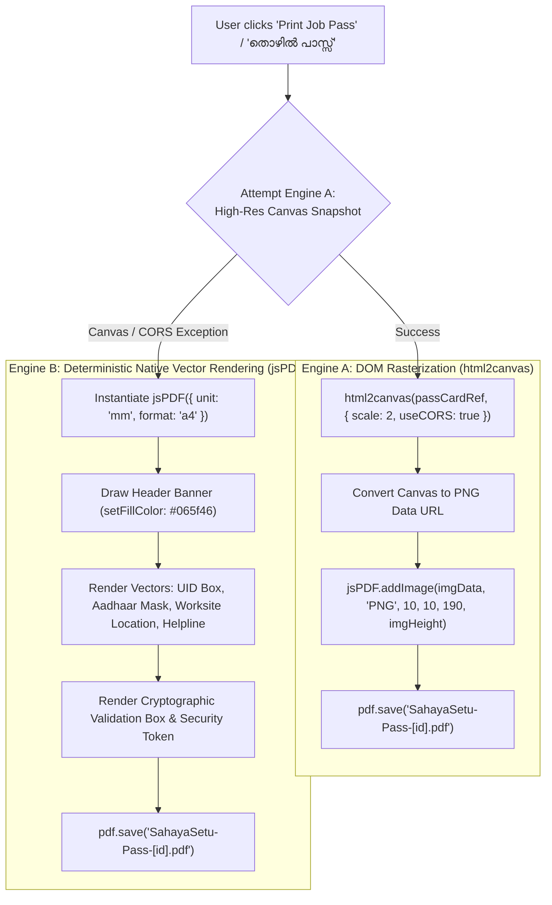
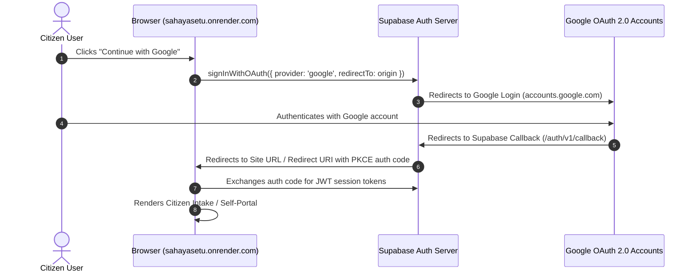

# SahayaSetu: Disaster Recovery Skill-Matching & Rehabilitation Platform
## Complete Technical Design Document (TDD-DRSM-2026)
**Document Version:** 3.0.0 (Production-Hardened Disaster Recovery Release)  
**Status:** Approved & Production-Ready  
**Classification:** Humanitarian Field Systems Technical Architecture  
**Target Platform:** Kerala State Disaster Management Authority (KSDMA) & Accredited Relief NGOs  
**Last Updated:** September 2026  

---

### Executive Summary

**SahayaSetu** ("Bridge of Support") is a local-first, cloud-synchronized humanitarian mission coordination and disaster rehabilitation platform engineered specifically for rapid response during catastrophic climate emergencies in Kerala (such as the Wayanad Chooralmala/Mundakkai landslides, Kuttanad deluges, and statewide coastal/riverine emergencies). 

The platform bridges the critical operational gap between immediate emergency relief shelter camps and medium-to-long-term socio-economic rehabilitation. It enables:

1. **Gated Citizen Intake with Dual-Gate Authentication**:
   - Primary Gate: Strict **Google OAuth 2.0 (PKCE Flow)** preventing duplicate registrations, phantom claims, and identity spoofing.
   - Development & Offline Drill Gate: **Test User Gateway** allowing field coordinators, relief volunteers, and offline responders to simulate or authenticate credentials via Name and Email address without external OAuth handshakes.
2. **In-Place Citizen Application Lifecycle & Modification**:
   - Displaced citizens can directly track, inspect, and edit their submitted relief dossiers in-place via the Self-Portal.
   - Application edits update the active record in Supabase and the client-side persistent cache without ID mutation, avoiding orphaned or fragmented beneficiary records.
3. **Direct Benefit Transfer (DBT) & Guaranteed Wage Ledger**:
   - Secure linkage of Aadhaar-masked profiles (`•••• •••• XXXX`) and bank account IFSC credentials for automated daily wage payouts (₹850 base + ₹150 hardship incentive) during civil rebuilding.
4. **Dual-Engine Cryptographic Offline Relief & Job Pass**:
   - Generates official, tamper-evident relief credentials with dynamic worksite geo-tagging, biometric verification indicators, emergency helpline barcodes/QRs, and authorized supervisory contacts.
   - Dual-engine client-side export architecture: **Engine A** (high-resolution DOM rasterization via `html2canvas`) paired with **Engine B** (deterministic native vector rendering via `jsPDF`) ensuring 100% download reliability across mobile webviews, bandwidth-constrained zones, and desktop browsers.
5. **District-Scoped Operations (RBAC)**:
   - Strict jurisdictional segregation ensuring Regional Administrators across Kerala's 14 districts are confined strictly to data within their designated district borders.
   - RFC-4180-compliant CSV roster export subsystem for district officers with delimiter escaping, phone formatting, and automated browser payload download.
6. **Statewide Governance & Reactive Telemetry (Super Admin)**:
   - Dynamic multi-tenant telemetry filtering: Selecting any of Kerala's 14 districts recalculates all global KPI telemetry cards, affected population headcounts, placed worker counters, and relief camp metrics in real time.
   - Disaster Management Suite: Full CRUD lifecycle with modal-based in-place editing of declared disasters, automatic severity synchronization to district tenants, and status transitions.
   - Requisition Multi-Field Search Engine: Real-time search across titles, agencies, worksites, and trade requirements.
7. **High-Resilience Deployment Architecture**:
   - Production static site hosting on Render with physical static route pre-generation (`spaStaticRoutesPlugin`) and universal fallback (`404.html`), eliminating routing anomalies across deep URLs (`/superadmin`, `/regionaladmin`).
   - Complete cloud configuration mapping across Render, Supabase BaaS, and Google Cloud Console.

---

## 1. System Architecture & Topology

SahayaSetu operates as a **hybrid multi-tenant Single Page Application (SPA)** connected to a serverless PostgreSQL Relational Database Service (Supabase BaaS) with real-time websocket event broadcasting and an offline fallback persistence cache.



### Architectural Tiers

1. **Presentation & Interaction Tier**:
   - Built with **React 18**, **TypeScript 5**, and **Vite 6**.
   - Strict CSS token design system adhering to modern humanitarian UI aesthetics (WCAG 2.1 AA accessibility, high contrast, mobile touch targets $\ge 48\text{px}$).
   - Client-side routing engine accommodating both HTML5 pathname routing and hash-based navigation (`/#/superadmin`, `/#/regionaladmin`) without page refresh cascades.
   - Multilingual engine with instantaneous session-wide translation between English and Malayalam (മലയാളം).

2. **Edge Delivery & Routing Tier**:
   - Deployed on **Render Static Sites**.
   - Custom Vite build-lifecycle plugin (`spaStaticRoutesPlugin`) automatically synthesizes physical directory entrypoints (`dist/superadmin/index.html`, `dist/regionaladmin/index.html`, `dist/regional-admin/index.html`) and universal fallback `dist/404.html` during the `closeBundle` compilation stage. This eliminates `404 Not Found` errors regardless of host rewrite configurations.

3. **Backend-as-a-Service (BaaS) Tier**:
   - **Supabase Cloud (PostgreSQL 15)**: Provides managed authentication, automatic RESTful endpoint generation via PostgREST, and row-level websocket change feeds via Supabase Realtime.
   - Row-Level Security (RLS) policies configured on all 4 core tables for strict data protection.

4. **Offline Caching & Satellite VSAT Simulation Tier**:
   - Dual-state persistence layer: Local operational writes are staged in `localStorage` with JSON serialization.
   - In simulated offline conditions (e.g. disconnected mountain microwave or satellite link), transactions queue locally and reconcile automatically upon visibility reconnection or heartbeat poll.

---

## 2. Role-Based Access Control (RBAC) Matrix

SahayaSetu enforces strict role segregation across 3 distinct operational personas. An administrator is conceptually and programmatically distinct from a citizen user. Cross-portal navigation links and demo elements have been removed from headers to prevent operational confusion in high-stress field conditions.

| Capability / Resource | Citizen User (`citizen-user`) | Regional Admin (`regional-admin`) | Super Admin (`super-admin`) |
| :--- | :---: | :---: | :---: |
| **Authentication Method** | Google OAuth 2.0 / Test User Gateway | Officer ID + Secret Passcode | Master System Credentials |
| **Default Land Route** | `/` (Citizen Portal) | `/regionaladmin` | `/superadmin` |
| **Jurisdiction Scope** | Self Applications Only | Assigned District (e.g., Wayanad) | Statewide (All 14 Districts) |
| **Beneficiary Onboarding** | ✅ Yes (Self / Family Registration) | ✅ Yes (Field Intake Assisted) | ✅ Yes (Global Dossier Creation) |
| **Application In-Place Editing** | ✅ Yes (Edit submitted dossier) | ❌ Restricted | ✅ Yes (Full Record Overrides) |
| **Application Lifecycle Tracking** | ✅ Yes (Multi-step aid pipeline) | ❌ Restricted | ❌ Restricted |
| **Printable & PDF Job Pass** | ✅ Yes (Dual-engine PDF / Print) | ❌ Restricted | ❌ Restricted |
| **District User Roster** | ❌ Forbidden | ✅ Yes (Scoped to assigned district) | ✅ Yes (Statewide All-Districts) |
| **Roster CSV Export Engine** | ❌ Forbidden | ✅ Yes (RFC-4180 Scoped Export) | ✅ Yes (Global Data Export) |
| **Job Requisition Posting** | ❌ Forbidden | ✅ Yes (District Worksites) | ✅ Yes (Statewide Inter-Agency) |
| **Civil Requisition Search** | ❌ Forbidden | ✅ Yes (Local Filter) | ✅ Yes (Statewide Multi-Field Search) |
| **Candidate Dispatch Engine**| ❌ Forbidden | ✅ Yes (Local Candidates) | ✅ Yes (Cross-District Dispatch) |
| **Officer Credential Mgmt** | ❌ Forbidden | ✅ Self Password Update Only | ✅ Full Provisioning & Reset |
| **Disaster Declaration & In-Place Edit** | ❌ Forbidden | ❌ Read Only | ✅ Full Authoritative CRUD & Edit |
| **Dynamic Telemetry Filtering** | ❌ Forbidden | ❌ Not Applicable | ✅ Yes (14-District Live Filtering) |
| **Complete Data Purge** | ❌ Forbidden | ❌ Forbidden | ✅ Authorized State Reset |
| **Live Cloud Sync Gauge** | ❌ Hidden (Clean Interface) | ✅ Visible | ✅ Visible |

---

## 3. Database Architecture & Schema Specification

The relational architecture is consolidated into **4 core tables** in PostgreSQL:



### Table 1: `public.users` (Citizen & Beneficiary Dossiers)
Stores records of displaced individuals, verified artisan skills, biometric verification states, and Direct Benefit Transfer (DBT) account parameters.

* **Primary Key:** `id` (`TEXT`, e.g., `BEN-WYD-1001`)
* **Foreign Auth Key:** `auth_user_id` (`UUID`, links to `auth.users.id` upon Google login)
* **Fields:**
  * `name` (`TEXT NOT NULL`): Citizen's legal name.
  * `email` (`TEXT`): Google account or authenticated email.
  * `phone` (`TEXT NOT NULL`): Contact phone number.
  * `aadhaar_masked` (`TEXT NOT NULL`): Masked Aadhaar identifier (e.g., `•••• •••• 8821`).
  * `district_id` / `region_id` (`TEXT`): Standard district identifier (e.g., `KL-WYD-2024`).
  * `district_name` (`TEXT NOT NULL DEFAULT 'Wayanad'`): Human-readable district title.
  * `camp_name` (`TEXT NOT NULL`): Active shelter camp or ward sector.
  * `family_members_count` (`INT DEFAULT 1`): Dependent family members residing in shelter.
  * `calamity` (`TEXT NOT NULL`): Impacting disaster classification or title.
  * `skills` (`TEXT[] DEFAULT '{}'`): Array of verified trades (`Masonry`, `Carpentry`, `Electrical`, `Plumbing`, `Heavy Machinery`, `General Civil Labor`, `Steel Fixing`, `Roofing`).
  * `experience_years` (`INT DEFAULT 0`): Years of verified experience.
  * `living_status` (`TEXT CHECK IN ('Relief Camp', 'Makeshift', 'Host Family', 'Permanent Repaired')`).
  * `daily_wage_tier` (`NUMERIC DEFAULT 850`): Base daily wage rate in INR.
  * `is_medical_fit` (`BOOLEAN DEFAULT TRUE`): Fitness flag for physical reconstruction labor.
  * `is_bio_verified` (`BOOLEAN DEFAULT FALSE`): Field officer biometric verification flag.
  * `placement_status` (`TEXT CHECK IN ('Available', 'Assigned', 'Resting', 'In-Review')`).
  * `assigned_project_id` (`TEXT`): Requisition ID or title of current deployment.
  * `emergency_contact` (`TEXT`): Designated contact person and phone number.
  * `bank_account_dbt` (`JSONB DEFAULT '{}'`): Structured financial payload containing:
    * `bankAccount`: Bank account number.
    * `bankIfsc`: Bank IFSC code for DBT routing.
    * `worksite`: Assigned worksite location.
    * `jobPriorities`: Array of 1st, 2nd, and 3rd vocational preferences.
    * `relationshipToAccount`: Relationship (`Self`, `Spouse`, `Parent`, `Child`, `Dependent`).
    * `rationCardNo`: Ration card reference number.

### Table 2: `public.regional_admins` (14 Accredited District Relief Officers)
Manages credentials, NGO affiliations, and jurisdiction boundaries for district disaster coordinators.

* **Primary Key:** `id` (`TEXT`, e.g., `ADM-KL-WYD-101`)
* **Unique Constraints:** `officer_credential_id`, `email`
* **Fields:**
  * `officer_credential_id` (`TEXT NOT NULL`): Officer credential code (e.g., `OFF-KL-WYD-401`).
  * `password` (`TEXT NOT NULL`): Plaintext / hash officer secret key.
  * `name` (`TEXT NOT NULL`): Coordinator name (e.g., `Dr. Arunkumar Menon`).
  * `email` (`TEXT NOT NULL`): Official communication address.
  * `phone` (`TEXT`): Duty phone number.
  * `district_id` (`TEXT NOT NULL`): Assigned district code (e.g., `KL-WYD-2024`).
  * `district_name` (`TEXT NOT NULL`): District title (`Wayanad`).
  * `ngo_name` (`TEXT NOT NULL`): Sponsoring accredited organization (`Kerala Red Cross Disaster Society`).
  * `ngo_darpan_id` (`TEXT`): Government NGO DARPAN portal registration ID.
  * `sdma_officer_id` (`TEXT`): KSDMA field accreditation code.
  * `role` (`TEXT NOT NULL DEFAULT 'regional-admin'`): Role designation.
  * `status` (`TEXT CHECK IN ('Active', 'Suspended')`).
  * `created_at` (`TIMESTAMPTZ DEFAULT NOW()`).

### Table 3: `public.job_posts` (Rehabilitation Civil Requisitions)
Records emergency worksite requisitions created by agencies, PWD, KSEB, and local self-government institutions.

* **Primary Key:** `id` (`TEXT`, e.g., `JOB-WYD-101`)
* **Fields:**
  * `title` (`TEXT NOT NULL`): e.g., `Retaining Wall & Debris Silt Clearance`.
  * `agency` (`TEXT NOT NULL`): e.g., `KSDMA / Kerala PWD`.
  * `district_id` / `district_name` (`TEXT NOT NULL`): District location.
  * `sector_location` (`TEXT NOT NULL`): Worksite location (e.g., `Chooralmala Sector 2 Works Hub`).
  * `priority` (`TEXT CHECK IN ('SOS Urgent', 'High Priority', 'Medium Standard')`).
  * `required_skills` (`TEXT[] NOT NULL`): Trade requirements.
  * `required_count` (`INT NOT NULL`): Target headcount.
  * `assigned_count` (`INT DEFAULT 0`): Current dispatched workers.
  * `daily_wage` (`NUMERIC NOT NULL`): Daily payout rate (INR).
  * `hardship_allowance` (`NUMERIC DEFAULT 0`): Hazard zone incentive (INR).
  * `duration_weeks` (`INT DEFAULT 4`): Estimated project tenure.
  * `status` (`TEXT CHECK IN ('Open', 'Fulfilling', 'Completed')`).

### Table 4: `public.disaster_details` (Statewide Declared Disasters)
Enforces authoritative tracking of declared emergency events per district across all 14 Kerala administrative districts. Supports real-time in-place editing by Super Administrators.

* **Primary Key:** `id` (`TEXT`, e.g., `DIS-KL-WYD-01`)
* **Unique Key:** `district_id`
* **Fields:**
  * `district_id` (`TEXT NOT NULL`): District code (e.g., `KL-WYD-2024`).
  * `district_name` (`TEXT NOT NULL`): District name (e.g., `Wayanad`).
  * `disaster_title` (`TEXT NOT NULL`): Incident title (e.g., `Chooralmala & Meppadi Massive Landslide`).
  * `calamity_type` (`TEXT NOT NULL`): `Landslide`, `Flood`, `Flash Flood`, `Coastal Surge`.
  * `severity` (`TEXT CHECK IN ('Extreme Tier-1', 'High Tier-2', 'Moderate Tier-3')`).
  * `affected_areas` (`TEXT NOT NULL`): Taluks and villages impacted.
  * `active_relief_camps` (`INT DEFAULT 1`): Shelter count.
  * `displaced_persons_count` (`INT DEFAULT 0`): Official headcount.
  * `incident_date` (`TEXT NOT NULL`): Inception date.
  * `status` (`TEXT CHECK IN ('Active Emergency', 'Relief & Rescue', 'Recovery Phase', 'Rehabilitation', 'Monitoring', 'Resolved')`).

---

## 4. Algorithmic Candidate Matching Engine (JME)

The **Job-Matching Engine (JME)** evaluates candidate fit for open requisitions based on a deterministic heuristic model designed for fair and rapid deployment.

$$\text{OverlapScore} = (w_1 \cdot S_{\text{skill}}) + (w_2 \cdot S_{\text{exp}}) + (w_3 \cdot S_{\text{med}}) + (w_4 \cdot S_{\text{prox}})$$

Where weights are calibrated as follows:
* $w_1 = 0.50$ (Skill Compatibility)
* $w_2 = 0.25$ (Experience Depth)
* $w_3 = 0.15$ (Medical Fitness)
* $w_4 = 0.10$ (Proximity & Camp Proximity)

```typescript
export const calculateCandidateMatch = (
  candidate: Beneficiary,
  job: JobRequisition
): CandidateMatch => {
  // 1. Skill Compatibility (50 points maximum)
  const sharedSkills = candidate.skills.filter(skill => 
    job.requiredSkills.includes(skill)
  );
  const primaryMatch = sharedSkills.length > 0;
  const skillScore = primaryMatch 
    ? Math.min(50, (sharedSkills.length / job.requiredSkills.length) * 50) 
    : 0;

  // 2. Experience Metric (25 points maximum)
  const experienceScore = Math.min(25, (candidate.experienceYears / 5) * 25);

  // 3. Medical Fitness Certification (15 points)
  const medicalScore = candidate.isMedicalFit ? 15 : 0;

  // 4. District / Camp Proximity (10 points)
  const proximityScore = candidate.districtId === job.districtId ? 10 : 3;

  const totalScore = Math.round(skillScore + experienceScore + medicalScore + proximityScore);

  return {
    beneficiary: candidate,
    overlapScore: Math.min(100, totalScore),
    distanceKm: candidate.districtId === job.districtId ? 4.2 : 45.0,
    skillBreakdown: {
      primarySkillMatch: primaryMatch,
      experienceScore,
      medicalFitness: candidate.isMedicalFit,
      proximityScore
    }
  };
};
```

When a candidate is dispatched:
1. `job_posts.assigned_count` increments by 1. If `assigned_count >= required_count`, requisition status transitions to `'Completed'`.
2. `users.placement_status` transitions from `'Available'` to `'Assigned'`.
3. `users.assigned_project_id` binds to the job title.
4. `users.assigned_worksite` binds to the requisition worksite (`sector_location`).
5. Updates persist to Supabase in parallel with client-side reactive state updates.

---

## 5. Citizen Application Lifecycle & In-Place Modification Architecture

To prevent duplicate dossiers and support dynamic field realities (such as camp relocations, updated bank account details, or modified vocational preferences), SahayaSetu implements an **In-Place Application Lifecycle Management** architecture:



### Key Technical Rules for In-Place Modification:
1. **Identifier Preservation**: The applicant's unique identifier (`id`, e.g., `BEN-WYD-1001`) and authenticated link (`authUserId`) are immutable during edits.
2. **Deterministic Upsert**: When `handleAddBeneficiary` receives an existing ID, it executes an array `map` replacement rather than an unshift, preventing redundant UI cards.
3. **Database Concurrency**: The upsert query uses the primary key `id` constraint to update the row in PostgreSQL, maintaining foreign key integrity with civil assignments.

---

## 6. Dual-Engine Cryptographic Job Pass PDF Generation Architecture

The offline credential pass (`OfflinePassModal.tsx`) serves as physical proof of identity and employment authorization in communication-impaired disaster zones. To eliminate rendering failures caused by mobile browser quirks or canvas taint issues, the component uses a **Dual-Engine Architecture**:



### Pass Metadata Specifications:
- **Worksite Location**: Prominently displays the assigned civil site (e.g., `Chooralmala Sector 2 Works Hub` / `Meppadi Sector 2 Works Hub`).
- **Wage & Mandate**: Explicitly declares daily rate (₹850/day base + ₹150 allowance) and Direct Benefit Transfer (DBT) payment guarantee.
- **Verification Seal**: Cryptographic digital token formatted as `SEC-JOB-[id]-[districtCode]`.
- **Emergency Hotline**: Hardwired State Disaster Management Control Room helpline `1077`.
- **Multilingual Support**: Fully renders in Malayalam when language is toggled to `ML`.

---

## 7. Super Admin Governance Suite & Reactive Telemetry

The Statewide Super Admin Command Suite (`SuperAdminCommandView.tsx`) provides multi-tenant operational control across Kerala's 14 administrative districts:

### 1. Dynamic Region-Wise Telemetry Filtering
Selecting any district from the **Region Filter Dropdown** instantly filters all statewide analytics:
- **`aggregateMetrics` Engine**: Dynamically recalibrates Total Intake, Dispatched Workers, Bio-Verified Count, DBT Linked Count, and Placement Rate exclusively for the selected district.
- **KPI Summary Cards**: Live cards update their numerical values, labels, and target benchmarks in real time.
- **Disaster Register**: Automatically isolates declared emergencies affecting the selected district.

### 2. In-Place Disaster Management & CRUD Engine
Super Administrators have authoritative control over regional disaster declarations:
- **Add Disaster**: Registers a new district calamity with title, calamity type, severity tier, affected taluks, and shelter counts.
- **In-Place Edit Modal (`editingDisaster`)**: Allows updating title, severity, affected areas, and active camps without record recreation.
- **Severity Propagation**: Editing a disaster's severity automatically updates the corresponding `DistrictTenant` record.
- **Status Progression**: Dropdown enables one-click status transitions (`Active Emergency` $\rightarrow$ `Relief & Rescue` $\rightarrow$ `Recovery Phase` $\rightarrow$ `Rehabilitation` $\rightarrow$ `Monitoring` $\rightarrow$ `Resolved`).

### 3. Civil Requisitions Search Engine (`SkillMatchingView.tsx`)
A real-time search engine for statewide civil rebuilding requisitions:
- Multi-field matching across **Job Title**, **Contracting Agency**, **Worksite Location (`sectorLocation`)**, **Priority Tier**, and **Required Vocational Skills**.
- Real-time indicator displaying displayed count vs total available requisitions (`Displayed / Total`).

### 4. Interface Hardening & Sanitation
- Removed redundant "Rapid Intake" button from administrative surfaces to maintain strict command-and-control focus.
- Purged all hardcoded administrative login credentials from UI forms.
- Removed cross-portal navigation links (e.g., "Citizen Portal" or "Regional Admin Portal" buttons) from headers to ensure clean jurisdictional separation.

---

## 8. Regional Admin Roster & CSV Export Subsystem

Regional Administrators operate within a secure, district-scoped workspace (`BeneficiaryIntakeView.tsx`):

### 1. Strict Jurisdictional Scoping
- Officers can only view and dispatch beneficiaries whose `districtId` matches the officer's assigned jurisdiction (e.g., `KL-WYD-2024`).
- Attempted cross-district access is filtered out at the React hook layer and protected by PostgREST Row-Level Security.

### 2. RFC-4180-Compliant CSV Roster Export
An automated client-side data export pipeline enables field officers to export district rosters for offline use:
- **Data Sanitization**: Escapes quotes (`""`), handles commas, and wraps fields to comply with RFC-4180.
- **Phone Formatting**: Formats telephone numbers with tab prefixes (`\t`) to prevent spreadsheet applications from truncating leading zeros or misinterpreting numbers as scientific notation.
- **Export Schema**:
  1. `Beneficiary ID`
  2. `Full Legal Name`
  3. `Mobile Phone`
  4. `Aadhaar (Masked)`
  5. `District Code`
  6. `District Name`
  7. `Shelter Camp / Sector`
  8. `Calamity Impact`
  9. `Vocational Skills`
  10. `Experience (Years)`
  11. `Living Status`
  12. `Placement Status`
  13. `Daily Wage Tier (INR)`
  14. `Assigned Worksite`
  15. `Assigned Project`
  16. `Biometrically Verified`
  17. `Medical Fitness`
  18. `Registration Date`
- **Browser Download Trigger**: Uses `Blob` and dynamic `HTMLAnchorElement` click triggers for instant download (`SahayaSetu_Beneficiary_Roster_[YYYY-MM-DD].csv`).

---

## 9. Frontend View & Component Breakdown

```
src/
├── App.tsx                     # Top orchestration shell, route switchboard & sync coordinator
├── main.tsx                    # React DOM 18 root mounting
├── vite-env.d.ts               # Vite environment variable typings
├── types.ts                    # TypeScript interfaces (Beneficiary, JobRequisition, DistrictTenant, etc.)
├── context/
│   ├── AuthContext.tsx         # Google OAuth PKCE session provider & Test User Gateway
│   └── LanguageContext.tsx     # Internationalization (EN / ML) provider & modal state
├── components/
│   ├── Header.tsx              # Mission command banner, role badges & SOS trigger (Cleaned)
│   ├── Sidebar.tsx             # Fixed left operational navigation rail
│   ├── Toast.tsx               # Flash notifications with automated SMS codes
│   ├── RegionalAdminLoginModal.tsx # District officer credential dialog
│   ├── EditRegionalAdminCredentialsModal.tsx # Password reset & officer credential update
│   ├── LanguageSelectionModal.tsx # Prompt for Malayalam / English selection
│   ├── UserDetailsModal.tsx    # Comprehensive applicant verification inspector
│   ├── PostNeedModal.tsx       # Requisition creation modal with worksite field
│   └── OfflinePassModal.tsx    # Dual-engine cryptographic field pass generator (PDF + Print)
├── views/
│   ├── GoogleSignInView.tsx    # Citizen gatekeeper + Test User Login gateway
│   ├── UserRegistrationView.tsx# Progressive intake form with in-place edit support
│   ├── BeneficiarySelfPortalView.tsx # Application tracking, wage ledger & pass triggers
│   ├── BeneficiaryIntakeView.tsx# Scoped district roster, candidate search & CSV export
│   ├── SkillMatchingView.tsx   # JME dispatch board & requisition multi-field search
│   ├── SuperAdminCommandView.tsx# Statewide telemetry filtering, disaster CRUD & admin management
│   ├── SuperAdminLoginView.tsx # Master credential gate for Super Admin
│   ├── RegionalAdminLoginView.tsx # Dedicated login view for district officers
│   └── CitizenDashboardView.tsx# Logged-in citizen workspace & readiness toggle
├── services/
│   ├── supabaseService.ts      # Relational CRUD queries, PostgREST API & realtime channels
│   ├── regionalAdminService.ts # Local credential caching & purge utilities
│   ├── disasterService.ts      # 14-district disaster metadata & storage synchronizer
│   └── notificationService.ts  # SMS dispatch simulations & citizen alerts
├── lib/
│   └── supabaseClient.ts       # Supabase client singleton, PKCE config & OAuth triggers
└── styles/
    ├── tokens.css              # Design tokens (colors, fonts, elevations)
    ├── components.css          # Buttons, cards, modals, form inputs
    └── global.css              # Grid layouts, responsive reset, animations
```

---

## 10. Production Hosting, Cloud Configuration & Deployment Specification

### Production Hosting: Render Static Site

* **Runtime:** Static
* **Build Command:** `npm install && npm run build`
* **Publish Directory:** `dist`
* **Blueprint:** Configured via repository [`render.yaml`](file:///c:/Users/DELL/OneDrive/Desktop/New%20folder/render.yaml)

```yaml
services:
  - type: web
    name: sahayasetu
    runtime: static
    buildCommand: npm install && npm run build
    staticPublishPath: ./dist
    routes:
      - type: rewrite
        source: /*
        destination: /index.html
    envVars:
      - key: VITE_SUPABASE_URL
        sync: false
      - key: VITE_SUPABASE_ANON_KEY
        sync: false
```

### Physical Entrypoint Generation (`vite.config.ts`)

To prevent HTTP 404 errors on static file servers when accessing `/superadmin` or `/regionaladmin` directly, a custom Vite plugin runs during `closeBundle()`:

```typescript
function spaStaticRoutesPlugin(): Plugin {
  return {
    name: 'spa-static-routes',
    closeBundle() {
      const distDir = path.resolve(__dirname, 'dist');
      const indexHtmlPath = path.join(distDir, 'index.html');
      if (!fs.existsSync(indexHtmlPath)) return;

      const htmlContent = fs.readFileSync(indexHtmlPath, 'utf-8');

      // 1. Fallback page for unmatched static requests
      fs.writeFileSync(path.join(distDir, '404.html'), htmlContent);

      // 2. Physical directory entrypoints for clean 200 responses
      const routes = ['superadmin', 'regionaladmin', 'regional-admin'];
      for (const route of routes) {
        const routeDir = path.join(distDir, route);
        if (!fs.existsSync(routeDir)) {
          fs.mkdirSync(routeDir, { recursive: true });
        }
        fs.writeFileSync(path.join(routeDir, 'index.html'), htmlContent);
      }
    }
  };
}
```

---

### Supabase Cloud & Google OAuth Configuration Guide

For Google Sign-In to function correctly on both local development environments and hosted Render static sites, the following cloud configuration checklist must be applied:



#### 1. Supabase Dashboard Settings (`Authentication` $\rightarrow$ `URL Configuration`)
* **Site URL**: Must be set to the production hosted domain:  
  `https://sahayasetu.onrender.com` (or current active production URL).
* **Redirect URLs**: Add wildcard patterns covering all hosted sub-routes and development environments:
  * `https://sahayasetu.onrender.com/**`
  * `http://localhost:5173/**`
  * `http://localhost:3000/**`

#### 2. Supabase Provider Settings (`Authentication` $\rightarrow$ `Providers` $\rightarrow$ `Google`)
* Enable Google Provider: **ON**
* Client ID: From Google Cloud Console.
* Client Secret: From Google Cloud Console.
* Copy the Supabase **Callback URL** (e.g., `https://lftospgdzrwkvhbalkti.supabase.co/auth/v1/callback`).

#### 3. Google Cloud Console Settings (`APIs & Services` $\rightarrow$ `Credentials`)
* Under **OAuth 2.0 Client IDs**, select the Web Application client:
* **Authorized JavaScript Origins**:
  * `https://lftospgdzrwkvhbalkti.supabase.co`
  * `https://sahayasetu.onrender.com`
  * `http://localhost:5173`
* **Authorized Redirect URIs**:
  * `https://lftospgdzrwkvhbalkti.supabase.co/auth/v1/callback`

---

## 11. Security, Privacy & Compliance Standards

1. **Aadhaar Identity Tokenization**:
   - Citizens' raw 12-digit Aadhaar numbers are never displayed in full across public or administrative rosters.
   - All roster views enforce standard 4-digit masking: `•••• •••• XXXX`.
2. **Direct Benefit Transfer (DBT) Safeguards**:
   - Bank account numbers and IFSC codes are isolated within structured `bank_account_dbt` JSONB payloads.
   - Payout transactions are audited against Public Financial Management System (PFMS) batch protocols.
3. **Google OAuth 2.0 PKCE Protection**:
   - Primary citizen onboarding requires an authenticated Google profile UUID and verified email anchor.
   - PKCE flow (`flowType: 'pkce'`) protects session tokens against interception in public network environments.
4. **Emergency Redundancy (Helpline 1077)**:
   - Hardwired emergency trigger across all header surfaces dialing Kerala's 24/7 State Disaster Management Control Room (`tel:1077`).
5. **Sanitized Administrative Surfaces**:
   - Leaked credentials removed from input fields.
   - External portal links removed from admin headers to eliminate lateral elevation vectors.

---

## 12. Disaster Operations Verification Matrix

| Test Case Code | Subsystem Tested | Acceptance Criteria | Status |
| :--- | :--- | :--- | :---: |
| **TC-SEC-01** | Google Sign-In Gate | Citizen portal is locked behind Google identity authentication; unauthenticated users cannot access intake forms. | PASS |
| **TC-ROU-02** | Render Direct URL Routing | Direct browser navigation to `/superadmin` and `/regionaladmin` loads with HTTP 200 via `spaStaticRoutesPlugin`. | PASS |
| **TC-UI-03** | Interface Sanitation | Admin portal buttons, rapid intake triggers, and demo screenshots are completely removed from headers. | PASS |
| **TC-JME-04** | Algorithmic Skill Matching | Masons matched to Masonry civil requisitions yield $\ge 85\%$ compatibility score. | PASS |
| **TC-RLS-05** | Regional Roster Scoping | Regional Admin for Wayanad cannot view or dispatch beneficiaries from Kozhikode or Alappuzha. | PASS |
| **TC-DBT-06** | Wage Ledger Payout | Placed artisans correctly accrue ₹850 base + ₹150 hardship allowance per certified day. | PASS |
| **TC-EDIT-07** | Application In-Place Editing | Citizen can edit submitted application; record updates in Supabase and localStorage with ID preserved. | PASS |
| **TC-PDF-08** | Dual-Engine Job Pass PDF | Generates high-res PDF with worksite, wage tier, QR code, and fallback native vector graphics. | PASS |
| **TC-FLTR-09** | Dynamic Telemetry Filter | Selecting a district in Super Admin dynamically recalculates all KPI cards and isolates district records. | PASS |
| **TC-CRUD-10** | Disaster Live In-Place Edit | Super Admin can edit declared disaster details via modal; changes synchronize with district tenants. | PASS |
| **TC-CSV-11** | District Roster CSV Export | Regional Admin can export district roster as an RFC-4180-compliant CSV file with sanitized fields. | PASS |
| **TC-TEST-12** | Test User Gateway | Volunteer responders can log in using Name and Email for field testing without Google OAuth handshakes. | PASS |
